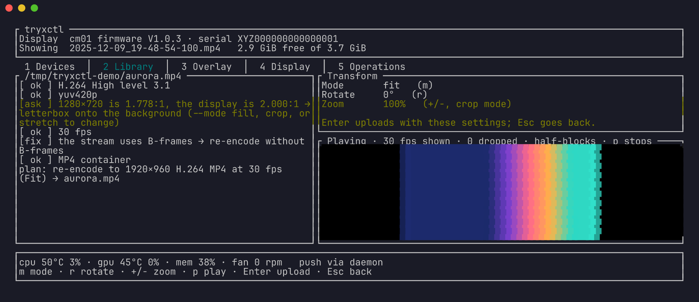
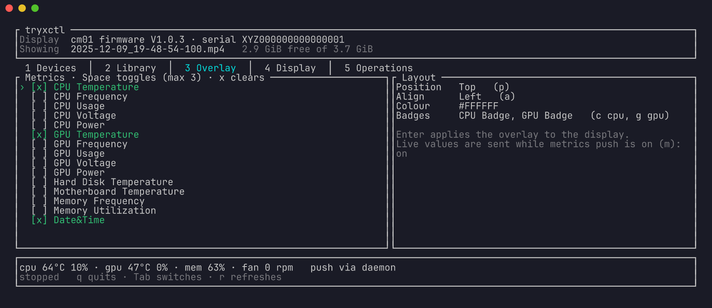

# tryxctl

Command-line and terminal-UI controller for TRYX cooler displays (Panorama SE,
Panorama, Turris 620) on Linux. One static binary, no Qt.



**Status: alpha.** Verified on a Panorama SE running the original cm01
firmware: media upload with validation and conversion, file management,
brightness, filters, a live metrics overlay, fan readings, previews, and the
terminal interface. Displays on the newer KANALI firmware (printer-class USB)
are driven through the same commands: catalog, upload, removal, brightness,
media selection, and the overlay. That backend is a port of the upstream
protocol tested against a scripted fake device, not yet against real hardware.
If you have a KANALI display, a report of what works and what does not is
very welcome; see [CONTRIBUTING.md](CONTRIBUTING.md).

## Disclaimer

tryxctl is an independent project. It is not made, endorsed, or supported by
TRYX, and product names appear here only to identify the hardware it works
with. It talks to the displays through unofficial, reverse-engineered
protocols, so a firmware update may break it without warning. It writes media
and settings to the display and can restart it. Use it at your own risk: the
software is provided as is, without warranty of any kind, as the
[licence](LICENSE) sets out.

## Install

Every release on the
[releases page](https://github.com/nicklambourne/tryxctl/releases) ships
static Linux binaries and Debian packages for x86_64 and aarch64.

- **Debian/Ubuntu**: `sudo apt install ./tryxctl_*.deb` installs the binary,
  the udev rules, the man page, and shell completions, and reloads udev.
- **Tarball**: unpack it, copy `tryxctl` somewhere on your `PATH`, copy
  `udev/*.rules` to `/etc/udev/rules.d/`, and run
  `sudo udevadm control --reload-rules`.
- **Nix**: `nix profile install github:nicklambourne/tryxctl`, or `nix build`
  in a checkout. The package wraps `ffmpeg` and `adb` onto the binary's `PATH`
  and ships the udev rules under `lib/udev/rules.d` for
  `services.udev.packages` on NixOS.

Then install the dependencies, join the device groups, and run
`tryxctl doctor`. It recognises Debian, Ubuntu, Fedora, Arch, openSUSE, NixOS,
and their derivatives, and prints that distribution's commands for anything
still missing.

### Dependencies

tryxctl runs `ffmpeg`, built with the `libx264` encoder, and `ffprobe` to
check and convert media, and `adb` to transfer it to displays on the original
cm01 firmware. The Debian package recommends them and the Nix package brings
its own. Otherwise, install them from your distribution.

Debian, Ubuntu, and derivatives such as Linux Mint and Pop!_OS:

```bash
sudo apt install ffmpeg adb
```

Fedora's own `ffmpeg-free` lacks `libx264`, so take `ffmpeg` from
[RPM Fusion](https://rpmfusion.org/Configuration):

```bash
sudo dnf install https://mirrors.rpmfusion.org/free/fedora/rpmfusion-free-release-$(rpm -E %fedora).noarch.rpm
sudo dnf install --allowerasing ffmpeg android-tools
```

Arch Linux and derivatives such as Manjaro and EndeavourOS:

```bash
sudo pacman -S --needed ffmpeg android-tools
```

openSUSE's own `ffmpeg` lacks `libx264` too, so take it from
[Packman](https://packman.links2linux.de/). These commands are for Tumbleweed;
on Leap, use `openSUSE_Leap_$releasever` in place of `openSUSE_Tumbleweed`:

```bash
sudo zypper addrepo -cfp 90 'https://ftp.gwdg.de/pub/linux/misc/packman/suse/openSUSE_Tumbleweed/' packman
sudo zypper refresh
sudo zypper dist-upgrade --from packman --allow-vendor-change
sudo zypper install --from packman ffmpeg
sudo zypper install android-tools
```

NixOS, in `configuration.nix`, if you run the tarball's binary rather than
the flake's package:

```nix
environment.systemPackages = with pkgs; [ ffmpeg android-tools ];
```

### Device groups

The display's device nodes belong to groups: the serial port and ADB
interface of the original cm01 firmware to `dialout` and `plugdev`, and a
KANALI display to `lp`. Join all three to cover either firmware; see
[Device access on Linux](#device-access-on-linux) for why they are needed.

Debian, Ubuntu, and derivatives:

```bash
sudo usermod -aG dialout,plugdev,lp "$USER"
```

Fedora, openSUSE, and other distributions that may have no `plugdev` group.
`groupadd -f` creates it only when it is missing:

```bash
sudo groupadd -f --system plugdev
sudo usermod -aG dialout,plugdev,lp "$USER"
```

Arch Linux and derivatives, where serial ports belong to `uucp` instead:

```bash
sudo groupadd -f --system plugdev
sudo usermod -aG uucp,plugdev,lp "$USER"
```

NixOS, in `configuration.nix`, with your user name in place of `alice`:

```nix
users.groups.plugdev = { };
users.users.alice.extraGroups = [ "dialout" "plugdev" "lp" ];
```

Log out and back in for the groups to apply, and replug the display if you
created `plugdev`, so the udev rule can hand it the device. `id -nG` lists
the groups a new login shell is in.

### Which firmware does my display run?

Run `tryxctl devices`. A display listed under "Legacy cm01 firmware", with a
serial port, runs the original firmware. One listed with a printer interface
and a `391a:` USB ID runs KANALI. The two behave differently in places; see
[Firmware differences](#firmware-differences).

## Usage

```bash
tryxctl doctor                                  # tools, permissions, connected displays
tryxctl devices                                 # what is connected and how
tryxctl info                                    # identify the display
tryxctl media ls                                # files on the display and free space
tryxctl media check clip.mp4                    # what would change, and why
tryxctl media check --target kanali-turris a.png  # ...for a display that is not connected
tryxctl media upload clip.mp4 --show            # validate, convert if needed, upload, play
tryxctl media upload long.mp4 --trim 30-90      # only part of a video
tryxctl media preview clip.mp4 --at 5           # a frame exactly as the display gets it
tryxctl media export clip.mp4 -o backup.mp4     # a copy of a file on the display
tryxctl media replace clip.mp4 new.mp4          # swap the file under its name, no gap
tryxctl op ls                                   # recent transfers; a failed one keeps its encode
tryxctl op retry 6aa17661ce3f                   # send it again without re-encoding
tryxctl show clip.mp4 --play Loop               # play something already on the display
tryxctl show preset:3                           # one of the six built-in animations
tryxctl display get                             # what the panel is set to
tryxctl display set --brightness 70
tryxctl display set --mode split --waterfall on --rotate 180
tryxctl display set --filter smoke --filter-opacity 60
tryxctl display set --sleep on                  # let the panel sleep with the host
tryxctl display reboot
tryxctl metrics set --labels cpu-temp,gpu-temp,cpu-usage --badges cpu,gpu
tryxctl metrics set --area right --labels gpu-usage   # the right half in split mode
tryxctl metrics status --watch 2                # host readings every 2 s
tryxctl fans --watch 5                          # fan RPM; pump RPM where the model reports it
tryxctl fans --lcd-speed 40                     # fixed display-block fan speed
tryxctl fans --lcd-speed auto                   # back to the firmware's curve
tryxctl daemon install                          # run the daemon as a systemd user service
tryxctl daemon status                           # what it knows: device, fans, pushes, last error
tryxctl tui                                     # everything above, interactively
tryxctl completions zsh > ~/.zfunc/_tryxctl
```

`tryxctl metrics set --labels` takes up to three of `cpu-temp`, `cpu-freq`,
`cpu-usage`, `cpu-voltage`, `cpu-power`, `gpu-temp`, `gpu-freq`, `gpu-usage`,
`gpu-voltage`, `gpu-power`, `disk-temp`, `mb-temp`, `mem-freq`, `mem-usage`,
and `date-time`. Not every firmware shows all of them; see
[Firmware differences](#firmware-differences).

Every command takes `--json` for machine-readable output, `-q` for results and
errors only, `--no-color`, and `-v` to dump the frames exchanged with the
display. With several displays attached, `--tty` picks a legacy serial port
and `--device` a KANALI USB ID, both listed by `tryxctl devices`. Exit codes:
2 usage, 3 device, 4 environment, 5 media rejected. `tryxctl help COMMAND`
covers every option, as does `man tryxctl` after a Debian or nix install.

### The daemon

The panel goes dark about a minute after the host stops talking to it, so
`tryxctl daemon install` is the normal way to run things. The daemon owns the
serial port and keeps the panel awake with live readings. It restores the
saved screen when it starts, reopens the link when the display reboots or is
replugged, and applies the screen again after the host wakes from sleep.

Other commands reach the display through the daemon's socket, so they never
compete for the port. Without a daemon every command opens the port itself,
and `--direct` forces that even when one is running.

The legacy firmware answers no queries, so `display get` reports what was last
applied. A KANALI display is read back for real.

### Firmware differences

| | Legacy cm01 (serial + ADB) | KANALI (printer-class USB) |
|---|---|---|
| Media | MP4, 1920×960 | raw H.264 at 2240×1080 (Panorama) or 1280×720 in the MXHD header (Turris 620); still images become loops |
| Names | as uploaded | suffixed `.h264_2240x1080` / `.h264_1280x720` |
| Overlay | up to 3 labels, incl. voltages and disk/motherboard temperature | up to 3 labels, incl. CPU/GPU power; no voltages |
| Keepalive | sysinfo push every few seconds | ping and overlay lease every 2 s |
| Filters, sleep, fans, reboot | yes | not in the protocol |
| Readback | none; `display get` shows the last applied state | `display get` reads the device |
| Pump RPM | only on models advertising `Turbo Pump`; the Panorama SE has no pump tachometer | not in the protocol |
| Storage | `df` over ADB | none; the catalog lists sizes |

## Terminal interface

`tryxctl tui` covers the same ground interactively, across five tabs: devices,
library, overlay, display, and operations.



### Previews and playback

The library previews the selected file as a short looping clip. The upload
wizard previews a local file as the display will get it, after the chosen fit,
rotation, and zoom. Previews run four seconds at six frames a second; a GIF
animates and a still image stays still. A file on the display whose index sits
at the end of the container, because it was written without faststart, is
copied to the cache once to make its preview.

Press `p` to play the selected file in real time instead. ffmpeg streams it at
its own pace, frames the redraw cannot keep up with are dropped, and the
pane's title shows the rate achieved.

### Graphics

Still previews use kitty graphics, iTerm2 images, or Sixel when the terminal
offers them, and coloured half-blocks otherwise.

Playback shows real pixels only on kitty-protocol terminals. On a local kitty
or Ghostty the frames travel through shared memory, so only a name crosses the
terminal per frame; elsewhere they are sent as zlib-compressed pixels. Over
SSH the picture is kept lean, at 480 pixels wide and 15 frames a second. Sixel
and iTerm2 terminals play in half-blocks, since they would resend every frame
in full, and so does everything inside tmux.

| Variable | Values | Effect |
|---|---|---|
| `TRYXCTL_GRAPHICS` | `kitty`, `iterm2`, `sixel`, `halfblocks` | Forces the graphics protocol. Inside tmux, together with `set -g allow-passthrough on`, this is how to get still pictures. |
| `TRYXCTL_KITTY_TRANSFER` | `shm`, `png`, `zlib` | Forces how kitty playback frames travel. PNG measures the same as zlib on video. |

### Keys

Each pane's title and the line at the bottom show the main keys for where you
are.

| Where | Key | Action |
|---|---|---|
| Anywhere | `Tab`, `Shift+Tab` | Next or previous tab |
| | `1` to `5` | Jump to a tab |
| | `r` | Refresh |
| | `m` | Start or stop pushing live metrics |
| | `x` | Cancel the encode while an upload is running |
| | `q`, `Esc`, `Ctrl+C` | Quit |
| Library | `↑` `↓` or `k` `j` | Move the selection |
| | `Enter` | Show the selected preset or file on the display |
| | `l` | Loop every file on the display |
| | `p` | Play or stop the selected file in the preview pane |
| | `e` | Export a copy of the selected file |
| | `d` | Delete the selected file; `y` confirms |
| | `u` | Upload: type a path and press `Enter` to open the wizard |
| Upload wizard | `m` | Cycle the fit: fit, fill, crop, stretch |
| | `r` | Rotate by 90° |
| | `+` `-` | Zoom in or out in 25% steps, for the crop fit |
| | `p` | Play or stop the file as the display will get it |
| | `Enter` | Upload with these settings |
| | `Esc` | Back to the library |
| Overlay | `↑` `↓` or `k` `j` | Move between metrics |
| | `Space` | Add or remove a metric, up to three |
| | `x` | Clear every metric |
| | `p` | Cycle the position: top, center, bottom |
| | `a` | Cycle the alignment: left, center, right |
| | `c`, `g` | Toggle the CPU or GPU badge |
| | `Enter` | Apply the overlay |
| Display | `←` `→` or `h` `l` | Brightness down or up by 5% |
| | `s` | Toggle split screen |
| | `w` | Toggle waterfall mode |
| | `o` | Cycle the rotation |
| | `g` | Read the display's settings back |
| | `Enter` | Apply brightness and layout |
| Operations | `↑` `↓` or `k` `j` | Move the selection |
| | `Enter` | Retry the selected failed transfer |
| | `c` | Clear the kept encodes |

The overlay and layout apply to whatever the display is showing, so choose
media in the library first.

## Files it writes

| Path | Contents |
|---|---|
| `$XDG_STATE_HOME/tryxctl/display.json` | The screen, overlay, brightness, rotation, and fan speed last applied, which the daemon restores |
| `$XDG_STATE_HOME/tryxctl/operations.json` | The transfer journal behind `tryxctl op` |
| `$XDG_CACHE_HOME/tryxctl/encodes/` | Encodes kept after a failed transfer, so `op retry` can resend without re-encoding |
| `$XDG_CACHE_HOME/tryxctl/thumbs/` | Preview clips, and whole copies of display files pulled for previews or playback |
| `$XDG_CONFIG_HOME/systemd/user/tryxctl.service` | The unit `daemon install` writes |
| `$XDG_RUNTIME_DIR/tryxctl/daemon.sock` | The daemon's socket |

`XDG_STATE_HOME`, `XDG_CACHE_HOME`, and `XDG_CONFIG_HOME` default to
`~/.local/state`, `~/.cache`, and `~/.config`. Without `XDG_RUNTIME_DIR` the
socket goes under the system's temporary directory instead.

A whole copy of a display file can be hundreds of megabytes. Everything under
`$XDG_CACHE_HOME/tryxctl` is safe to delete and is rebuilt when needed, and
`tryxctl op clear` empties the kept encodes on its own.

## Troubleshooting

Start with `tryxctl doctor`. It checks for `ffmpeg`, the `libx264` encoder,
`ffprobe`, and `adb`, for the udev rules and group memberships, and for
connected displays.

- **No display is found.** Check the cable, then run `tryxctl devices`. If the
  display is listed but access fails, install the udev rules, reload them with
  `sudo udevadm control --reload-rules`, and replug the display.
- **Permission denied on the serial port or USB device.** Join the
  [device groups](#device-groups) and log in again. The daemon runs under your
  systemd user manager, which keeps the groups it started with, so log out
  fully, or run `systemctl --user exit` and log back in.
- **adb reports "no permissions".** An adb server started before the udev rule
  was installed keeps the old permissions. Run `adb kill-server` and try again.
- **The panel goes dark after about a minute.** Nothing is keeping it awake.
  Run the daemon with `tryxctl daemon install`.
- **Commands fail straight after an upgrade.** The daemon still running is the
  old version, and an old daemon cannot always answer a new client. Restart it
  with `systemctl --user restart tryxctl.service`.
- **No pictures inside tmux.** Enable passthrough with
  `set -g allow-passthrough on` and run with `TRYXCTL_GRAPHICS=kitty`, or
  whichever protocol your terminal speaks. Playback inside tmux always uses
  half-blocks.
- **A preview of a file on the display is slow the first time.** Its index
  sits at the end of the file, so the whole file is copied once, then cached.
- **An upload is rejected.** Run `tryxctl media check FILE` to see each
  finding and the conversion that would fix it.

## Uninstall

1. Stop and remove the service with `tryxctl daemon uninstall`.
2. Remove the program. For the Debian package, run `sudo apt remove tryxctl`.
   For nix, find its entry with `nix profile list` and remove it with
   `nix profile remove`. For a tarball, delete the binary and the three
   `*-tryx-*.rules` files from `/etc/udev/rules.d/`.
3. Delete the state and cache if you no longer want them:
   `rm -rf ~/.local/state/tryxctl ~/.cache/tryxctl`.

Media you uploaded stays on the display. Remove it first with
`tryxctl media rm NAME` if you want it gone.

## Device access on Linux

Displays on the original `cm01` firmware expose a serial port owned by
`dialout` (`uucp` on Arch), plus an ADB interface that the
`71-tryx-legacy.rules` udev rule opens to `plugdev`. Printer-class (KANALI)
displays need the other two rules, or membership of the `lp` group.

## Contributing

Building from source, running the tests, and sending changes are covered in
[CONTRIBUTING.md](CONTRIBUTING.md). Notable changes in each release are listed
in [CHANGELOG.md](CHANGELOG.md).

## Attribution

The protobuf schemas and two of the udev rules are copied from
[DXVSI/Tryx-Linux-GUI](https://github.com/DXVSI/Tryx-Linux-GUI) (MIT), whose
protocol and media pipeline this project reproduces. Every upstream project it
draws on, with its licence notice, is listed in
[THIRD_PARTY.md](THIRD_PARTY.md).

## Licence

MIT, see [LICENSE](LICENSE).
